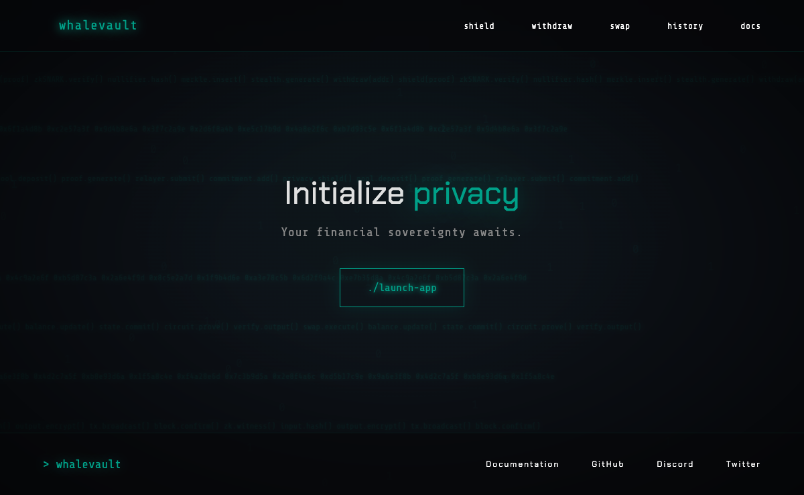
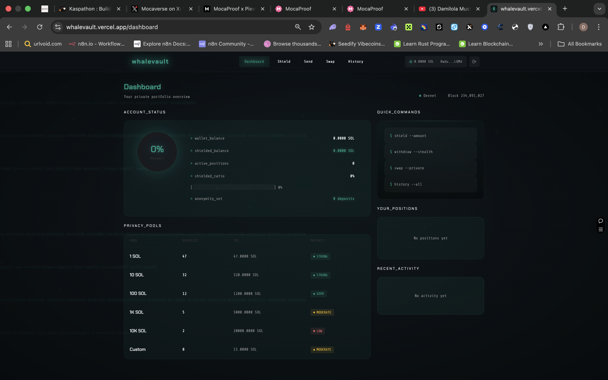
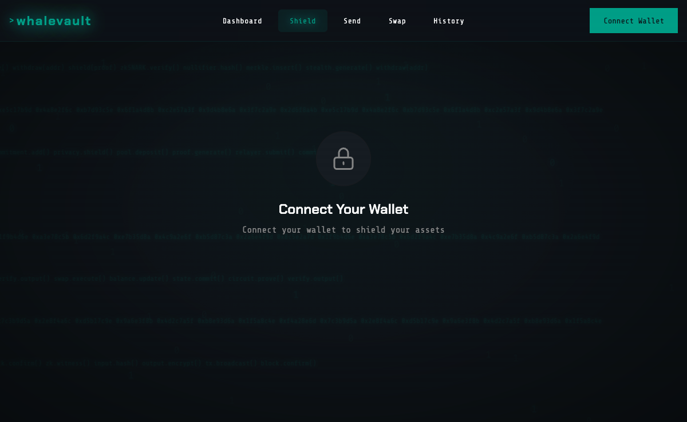
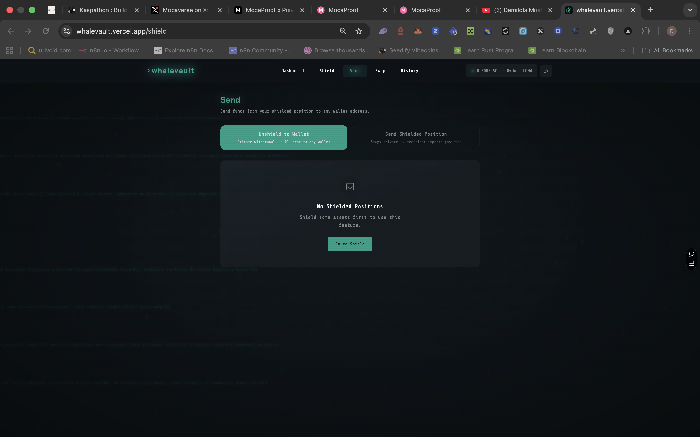
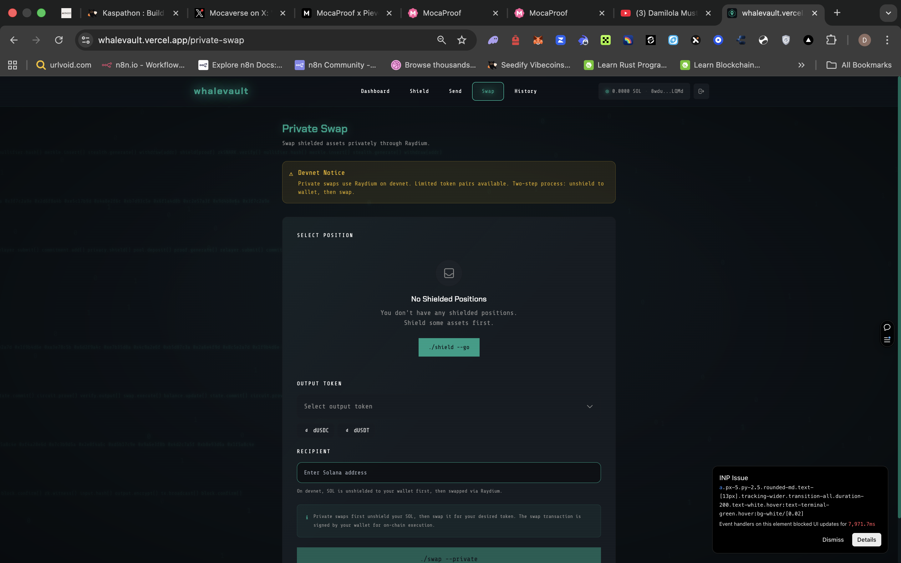

# WhaleVault — Privacy-Preserving Vault for Solana

> Shield, send, and swap Solana assets with zero-knowledge proof privacy.

[](https://www.typescriptlang.org/)
[](https://solana.com/)
[](LICENSE)



## Live Demo

**[→ whalevault.vercel.app](https://whalevault.vercel.app)**

Connect a Solana wallet to explore the full app.

## Demo Video

[](https://youtu.be/S7Zvx2GeAYY?si=tH4070I5h9osjW_z)

---

## What Is WhaleVault?

WhaleVault is a privacy layer for Solana. It lets users shield their assets into a private pool using zero-knowledge proofs — meaning transactions are verifiable on-chain but the amounts and parties involved remain private.

---

## Screenshots



| Shield | Send | Swap |
|--------|------|------|
|  |  |  |

---

## Features

- **ZK Proof Shielding** — Deposit assets into a private pool using zkSNARK proofs
- **Private Transfers** — Send shielded assets to any address without revealing amount
- **Private Swap** — Swap assets within the privacy pool
- **Transaction History** — View your private transaction history
- **Nullifier System** — Prevents double-spending within the privacy pool
- **Merkle Tree** — Cryptographic proof of inclusion without revealing identity
- **Non-Custodial** — You control your keys at all times

---

## Tech Stack

| Layer | Technology |
|-------|-----------|
| Frontend | Next.js 14, TypeScript, Tailwind CSS |
| Blockchain | Solana Web3.js |
| Privacy | Zero-Knowledge Proofs (zkSNARKs) |
| State | Zustand |
| UI | shadcn/ui |
| Deployment | Vercel |

---

## How It Works

```
User deposits SOL/tokens
        │
        ▼
ZK proof generated client-side
(proves ownership without revealing amount)
        │
        ▼
Commitment added to on-chain Merkle tree
(verifiable but private)
        │
        ▼
Nullifier stored to prevent double-spend
        │
        ▼
User can withdraw to any address
with a fresh ZK proof
```

The key insight: the proof says "I know a secret that corresponds to a valid deposit" — without revealing *which* deposit or *how much*.

---

## Running Locally

```bash
git clone https://github.com/dmz4pf/whalevault.git
cd whalevault
npm install
cp .env.example .env.local
npm run dev
```

---

## Architecture

```
src/
├── app/              # Next.js App Router pages
├── components/       # UI components
│   ├── shield/       # Shielding interface
│   ├── send/         # Private transfer
│   └── swap/         # Private swap
├── lib/
│   ├── zk/           # ZK proof generation & verification
│   ├── solana/       # Solana Web3.js integration
│   └── merkle/       # Merkle tree implementation
└── stores/           # Zustand state management
```

---

## License

MIT
